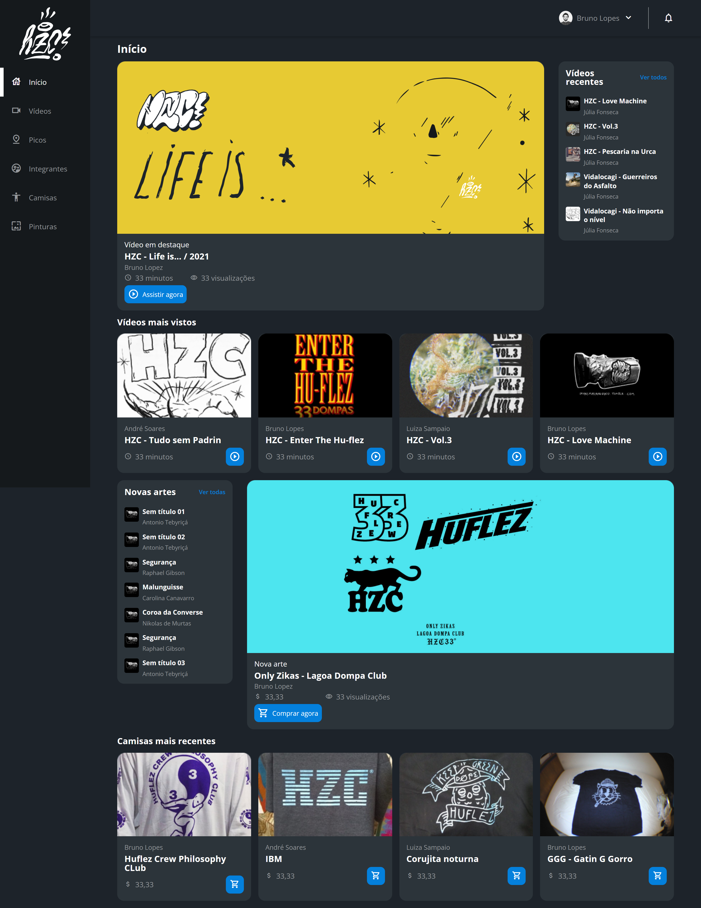

# CSS Flex e Grid

> Versão Mobile

> Versão Desktop

> Aula sobre os usos dos elementos Flex e Grid no CSS

Projeto construído durante as aulas da plataforma Alura, sobre os elementos Flex e Grid. Durante o projeto foi abordado as vantagens e utilização de grid areas; Propriedades de posicionamento de um flex-item com justify-self e align-self e outros conhecimentos. Ainda faltam alguns ajustes finais, que serão feitos em breve. Será implantada outra área no projeto, tendo em base todo o conteúdo visto nas aulas.

[🔗 Clique aqui para acessar](https://flex-e-grid-main-jkmf.vercel.app/)

## 🛠 Tecnologias

- HTML
- CSS
- Git e Github
- JavaScript

## 🐱 Contato

gusgomezcano@gmail.com

